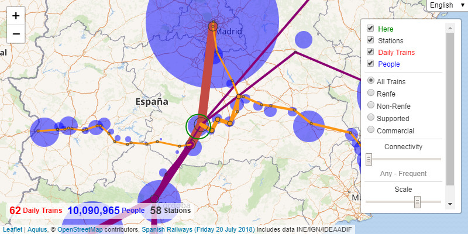

# Aquius

> _Here+Us_ - An Alternative Approach to Public Transport Network Discovery

## Description

[](https://timhowgego.github.io/Aquius/live/es-rail-20-jul-2018/#x-3.296/y39.092/z7/c-3.966/k38.955/m8/s7/vlphn)

Aquius visualises the links between people that are made possible by transport networks. The user clicks once on a location, and near-instantly all the routes, stops, services, and connected populations are summarised visually. Aquius answers the question, what services are available _here_? And to a degree, who am I connected to by those services? Population is a proxy for all manner of socio-economic activity and facilities, measured both in utility and in perception. This approach differs from most conventional public transport network mapping:

1. Aquius calculates frequencies, not detailed schedules. Conventional journey planners are aimed at users that already have some understanding of what routes exist. 
1. Aquius relates to a bespoke location, not an entire network. Most network maps are pre-defined and necessarily simplified, typically showing an entire city or territory.

Conceptually Aquius is half-way between those two. The application makes no server queries (once the initial dataset has been loaded), so responds near-instantly. That speed allows network discovery by trial and error, which changes the user dynamic from _being told_, to playful learning. Those advantages cannot maintain all the features of existing approaches to public transport information, notably:

* Aquius maps links, not routes. Straight-line links are shown between defined service stops, not drawn along the precise geographic route taken. This allows services that do not stop at all intermediate stops to be clearly differentiated. It also makes it technically possible for an internet client to work with a large transport network. However Aquius is limited to displaying conventional scheduled public transport, and perhaps not display information in the manner users have come to expect.
* The project was initially developed for network analysis, where a snapshot of the entire network is taken as a proxy for all days. More specific filters (for example, before 10:00, or on Sunday) could be crudely hacked in as separate products (detailed in Data Structure), however to handle this optimally Aquius would need some modest code and data structure rewrites.
* Only the direct service from _here_ is shown, not journeys affected by interchange. Certain networks (especially urban) may presume interchange at key points in the network. It is theoretically possible to define such interchange from one service to one other service of the same type within the network dataset by mimicking a service which splits into two porions part-way through its journey. However if the desire is to show all possible interchanges withut letting users explore the possibilities for themselves, then Aquius is not the logical platform to use: Displaying all possible interchanges quickly results in a map of every service, that then fails to convey what is genuinely local to _here_.

Ready to explore? [Try a live demonstration](https://timhowgego.github.io/Aquius/live/)!

In this document:

* [User FAQ](#user-faq)
* [Quick Setup](#quick-setup)
* [Limitations](#limitations)
* [Known Issues](#known-issues)
* [Configuration](#configuration)
* [Data Structure](#data-structure)
* [License](#license)
* [Contributing](#contributing)

## User FAQ

*How are services counted?* Within the boundary of _here_ all unique services are counted in whatever direction each is operated. The overall total of unique services is displayed in the bottom left panel. Outside _here_, only the services from _here_ to there (in that specific direction) are displayed. The counts that appear as tooltips for specific stops and links follow the same logic. This is more intuitive where _here_ includes several stops, since the services between those stops are counted in both directions (because each stop is both origin and destination of the other). Services (typically trains) that split mid-journey are counted once over common sections. Individual services that combine more than one product together on the same vehicle are counted no more than once, by the longer distance component unless that has been filtered out by the choice of network.

*How are people counted?* This varies by dataset, but broadly: Population is that of the local area (municipality or similar) containing one or more stops linked to _here_ by one or more of the services shown. Plus the population of _here_ itself. For example, in the Spanish Railway dataset the population is that of the municipal Padrón at the start of 2017. Long distance services often have a wider population catchment than just the local municipality of the stations they serve, so this count of people must be read with caution. For example, "Camp Tarragona" ostensibly serves long distance travel from Tarragona and Reus, but is located in neither. However Camp Tarragona cannot fairly be attributed the population of its natural hinterland without factoring in penalties for local interchange and travel time: Such advanced analysis would be possible, but complicates the simple message the population bubbles are intended to convey.

*What do the line widths and circle diameters indicate?* Links and stops are scaled by the logarithm of the service (such as total daily trains), so at high service levels the visual display is only slightly increased. Increasing the scale increases the visual distinction between service levels, but may flood the view in urban areas. The area of each population circle is in proportion to the number of residents. The original numbers are displayed in a tooltip, visible when mousing over (or similar) the line or circle. The here circle defines the exact geographic area of _here_, that searched to find local stops.

*How can everything be displayed?* Zoom out a lot, then click... The result may be visually hard to digest, and laggy - especially with an unfiltered network or when showing multiple map layers: Aquius wasn't really intended to display everything.

## Quick Setup

As is, Aquius simply builds into a specific `HTML` element on a web page, the most basic configuration placed in the document `body`:

```html
<div id="aquius-div-id" style="height:100%;"></div>
<script src="absolute/url/to/aquius.js" async></script>
<script>window.addEventListener("load", function() {
  aquius.init("aquius-div-id");
});</script>
```

Older browsers also require the `html` and `body` elements to be styled with a `height` of 100% before correctly displaying the `div` at 100%. Absolute paths are recommended to produce portable embedded code, but not enforced.

The first argument of the function `aquius.init()` requires a valid `id` refering to an empty element on the page. The second optional argument is an `Object` containing keyed options which override the default configuration. Three option keys are worth introducing here:

* `dataset`: `String` (quoted) of the full path and filename of the JSON file containing the network data (the default.json dataset is empty).
* `locale`: `String` (quoted) of the initial [BCP 47-style](https://en.wikipedia.org/wiki/IETF_language_tag) locale, currently `en-US` or `es-ES`. Users may choose their language - this option simply defines the initial state.
* `uiHash`: `Boolean` (true or false, no quotes) indicating whether Aquius records its current state as a hash in the browser's URL bar (great for sharing, but may interfere with other elements of web page design).

Others options are documented in the [Configuration](#configuration) section below. Here is an example with the Spanish Railway dataset:

```html
<div id="aquius" style="height:100%;"></div>
<script src="https://timhowgego.github.io/Aquius/dist/aquius.min.js"
  async></script>
<script>window.addEventListener("load", function() {
  aquius.init("aquius", {
    "dataset": "https://timhowgego.github.io/Aquius/data/es-rail-20-jul-2018.json",
    "uiHash": true,
    "locale": "es-ES"
  });
});</script>
```

**Caution:** The only function guaranteed to remain accessible is `aquius.init()`. The current externally exposed function structure is a work in progress.

## Limitations

* Aquius is conceptually inaccessible to those with severe visual impairment ("blind people"), with no non-visual alternative available.
* Internet Explorer 9 is the oldest vintage of browser theoretically supported, although a modern browser will be faster (both in use of `Promise` to load data and `Canvas` to render data). Mobile and tablet devices are supported, although older devices may lag when interacting with the map interface.
* Aquius is written in pure Javascript, automatically loading its one dependency at runtime, [leaflet](https://github.com/Leaflet/Leaflet). Aquius can produce graphically intensive results, so be cautious before embedding multiple instances in the same page, or adding Aquius to pages that are already cluttered.
* For now, there is no automated method of constructing Aquius' datasets: Aquius was built to understand Spain, which is still largely devoid of [electronic interchangeable data](https://transit.land/feed-registry/?country=ES). The current dataset format is described in the [Data Structure](#data-structure) section below, and eventually a GTFS converter might get written.
* What works in Spain might become more technically problematic should the whole of Europe be deposited into one unfiltered dataset. As is, a 2010-era computer mapping every rail service from Madrid takes about 50ms to do the calculations and another 50ms to map the result, which can then lag slightly when moved.

## Known Issues

Aquius is a work in progress, especially in the (dis)organisation of its code. Some issues may be fixed, others are likely to remain as is. This section tries to explain the reasoning behind particular quirks.

### General

Aquius is fundamentally inaccessible to those with severe visual impairment: The limitation lay in the concept, not primarily the implementation. Aquius can't even read out the stop names, since it doesn't know anything about them except their coordinates. Genuine solutions are more radical than marginal, implying a quite separate application. For example, conversion of the map into a 3D soundscape, or allowing users to walk a route as if playing a [MUD](https://en.wikipedia.org/wiki/MUD).

Tooltips may display in haphazard positions: Tooltips display in the middle of the visual element plotted, however multiple links are often draw as multiple elements (with the same service value) connected together, so _the middle_ ceases to be visually apparent.

GeoJSON Export has no service or population data. The polylines are disjointed: As is, the export simply mirrors the internal construction of the map, which tries to find adjoining links with the same service frequency and attach them to one continuous polyline. The logic simply reduces the number of objects substantially (by about 90% on the Spanish Railway dataset) as efficiently as possible, but is not guaranteed to find all, nor necessarily link the paths taken by individual services. Exactly how to assign data properties to features in [Leaflet](https://github.com/Leaflet/Leaflet)'s `toGeoJSON()` method was also unclear, and currently the numeric data displayed is only attached as a tooltip. The GeoJSON Export feature is strictly marginal, and serious analysis or alternative presentation is probably better working with an original dataset.

Localisation user interface selector will explode with many languages: Radio buttons were used because these are easier for mobile/tablet. In future a `select` element will be needed if more than 3 locales are included.

Localisation of numbers in the bottom-left panel requires a map redraw. And the order of the numbers and words cannot be localised: This panel was originally intended to be animated rather than numeric, and consequently the associated localisation had to be retrofitted, rendering an array of minor problems that aren't yet serious enough to rewrite.

Multiple base maps can be added but only one may be displayed: A user selection and associated customisation was envisaged for the future.

Circular services that constitute two routes in different directions, that share some stops but not all, display with the service in both directions serving the entire shared part of the loop: Circular services normally halve the total service to represent the journey possibilities either clockwise or counter-clockwise, without needing to decide which direction to travel in to reach any one stop. Circular services that take different routes depending on their direction cannot simply be halved in this manner, even over the common section, because the service level in each direction is not necessarily the same. Consequently Aquius would have to understand which direction to travel in order to reach each destination the fastest. That would be technically possible by calculating distance, but would remain prone to misiinterpretation, because a service with a significantly higher service frequency in one direction might reasonably be used to make journeys round almost the entire loop, regadless of distance. The safest assumption is that services can be ridden round the loop in either direction. In practice this issue only arises [in Parla](https://timhowgego.github.io/Aquius/live/es-rail-20-jul-2018/#x-3.76265/y40.23928/z14/c-3.7669/k40.2324/m10/s5/vlphn/n2).

### Spain

Spanish Railway dataset population bubbles are not centered on towns: These are located at the centroid of the municipality, which does not necessary relate to the main settlement. Their purpose is simply to indicate the presence of people at a broad scale, not to map nuances in local population distribution.

Spanish Railway dataset services are not totally accurate: The network was research in one direction (away from Madrid), during academic holidays, and with a Cercanías journey planner that only showed origin/destination and not the stops inbetween. Likewise service totals for many city metros were calculated from average headways, so won't be perfectly accurate. Tourist-type services have been excluded. International services only within Spain. For an introduction to the dataset, see [Disassembling Trenes](https://timhowgego.wordpress.com/2018/09/04/disassembling-trenes/).

Spanish Railway dataset summarises certain circular service incorrectly: Madrid's C-7 at Atocha is a specific exception to the rule that circular services are counted just once, because each C-7 loop serves different stations, and consequently the count of trains specifically at Atocha (the total arrival/departure in all directions) differs from the count of trains in the bottom-left panel (the total number of unique services involved). The quirks of the Parla tram, which is both circular and differs by direction, were discussed above.

## Configuration

As described in the [Quick Setup](#quick-setup) section, the second optional argument of `aquius.init()` takes an `Object` containing keys and respective values. Any key not specified will use the default. Bespoke options must conform to the expected data `type`.

*Tip*: Clicking the `Embed` link on the bottom of the Layer Control will produce a dummy HTML file containing all the current settings. This sets the initial map and layer view to match those at the moment the Embed was produced, and generates a full list of options which includes those options that can only be set via `aquius.init()`.

### Data Sources

All except `dataset`, introduced in the [Quick Setup](#quick-setup) section, can be happily ignored in most cases.

Key|Type|Default|Description
---|----|-------|-----------
base|Array|See below|Array of objects containing base layer tile maps, described below
dataset|string|"default.json"|JSON file containing network data: Recommended full URL, not just filename
locale|string|"en-US"|Default locale, BCP 47-style: User selection is `t`
network|Array|[]|Extension of `network`: Array of products, Object of locale keyed names
translation|Object|{}|Custom translations: Format matching `aquius.LOC`

For base mapping, `base` is a complex `Array` containing one or more tile layers, each represented as an `Object`. Within, the key `url` contains a `string` URI of the resource, potentially formatted as [described by Leaflet](https://leafletjs.com/reference-1.3.4.html#tilelayer). WMS layers require a specific key `type`: "wms". Finally a key called `options` may be provided, itself containing an `Object` of keys and values, matching Leaflet's options. Or in summary:

```javascript
"base": [
  {
    "url": "http://{s}.tiles.wmflabs.org/bw-mapnik/{z}/{x}/{y}.png", 
    "type": "",
      // Optional, if WMS: "wms"
    "options": {
      // Optional, but attribution is always advisable
      "attribution": "&copy; <a href=
        'http://www.openstreetmap.org/copyright'>OpenStreetMap</a>
        contributors"
    }
  }
    // Extendable for multiple maps
]
```

The default `locale` needs to be fully translated, since it becomes the default should any other language choice not be translated.

The extension of `network` allow extra network filters to be appended to the defaults provided in the JSON `dataset`. For example, in the Spanish Railways dataset a separate network filter for [FEVE](https://en.wikipedia.org/wiki/Renfe_Feve) could be created using the product's ID, here 14, and its name. Multiple products or networks can be added in this way. See the [Data Structure](#data-structure) section for more details.

```javascript
"network": [ 
  [ 
    [14],
      // Product ID(s)
    {"en-US": "FEVE"}
      // Locale:Name, must include the default locale
  ] 
  // Extendable for multiple networks
]
```

The `translation` `Object` allows bespoke locales to be hacked in. Bespoke translations take precedence over everything else. Even network names can be hacked by referencing key `network0`, where the final `integer` is the index position in the network `Array`. While this is not the optimal way to perform proper translation, it may prove convenient. The structure of `translation` matches that of Aquius' LOC global. Currently translatable strings are listed below. Missing translations default to `locale`, else are rendered blank. 

```javascript
"translation": {
  "xx-XX": {
    // BCP 47-style locale
    "language": "X-ish",
      // Required language name in that locale
    "embed": "Embed",
      // Translate values into locale, leave keys alone
    "export": "Export",
    "here": "Location",
    "link": "Services",
    "node": "Stops",
    "place": "People",
    "scale": "Scale"
  }
    // Extendable for multiple locales
}
```

The remaining configurations are far more basic.

### Styling

Formatting of visual elements, mostly on the map.

Key|Type|Default|Description
---|----|-------|-----------
hereColor|string|"green"|CSS Color for here layer circle strokes
linkColor|string|"red"|CSS Color for link (service) layer strokes
linkScale|float|1.0|Scale factor for link (service) layer strokes: ceil( log( 1 + ( service * ( 1 / ( scale * 4 ) ) ) ) * scale * 4)
nodeColor|string|"black"|CSS Color for node (stop) layer circle strokes
nodeScale|float|1.0|Scale factor for node (stop) layer circles: ceil( log( 1 + ( service * ( 1 / ( scale * 4) ) ) ) * scale * 2)
panelScale|float|1.0|Scale factor for text on the bottom-left summary panel
placeColor|string|"blue"|CSS Color of place (population) layer circle fill
placeOpacity|float|0.5|CSS Opacity of place (population) layer circle fill: 0-1
placeScale|float|1.0|Scale factor for place (population) layer circles: ceil( sqrt( people * scale / 666)

**Caution:** Colors accept any CSS format, but be wary of introducing transparency this way, because it tends to slow down rendering.

### User Interface

Enable or disable User Interface components.

Key|Type|Default|Description
---|----|-------|-----------
uiHash|boolean|false|Enables recording of the user state in the URL's hash
uiLocale|boolean|true|Enables locale selector
uiNetwork|boolean|true|Enables network selector
uiPanel|boolean|true|Enables summary statistic panel
uiScale|boolean|true|Enables scale selector
uiShare|boolean|true|Enables embed and export

**Caution:** This won't block the associated code if it can be entered by an alternative means, such as the hash.

### User State

As seen in the URL hash (if `uiHash` is `true`). Coordinates are always WGS 84. Map click defines the centre of the search.

Key|Type|Default|Description
---|----|-------|-----------
c|float|-0.89|_Here_ click Longitude
k|float|41.66|_Here_ click Latitude
m|integer|11|_Here_ click zoom
n|integer|0|User selected network filter: Must match range of networks in `dataset`
v|string|"lph"|Displayed map layers by first letter: here, link, node, place
s|integer|5|User selected global scale factor: 1,3,5,7,9
t|string|"en-US"|User selected locale: BCP 47-style
x|float|-3.689|Map view Longitude
y|float|40.405|Map view Latitude
z|integer|6|Map view zoom

*Tip:* Instead of specify `s`, alter the corresponding `linkScale`, `nodeScale`, and/or `placeScale`. Instead of specifying `t`, alter the default `locale`.

## Data Structure

Aquius requires a network `dataset` JSON file to work with. The dataset file uses a custom data structure, one intended to be sufficiently compact to load quickly, and thus shorn of much human readability and structural flexibility. The dataset file will require custom pre-processing by the creator of the network. As is, there is no automated tool for this, although one might yet emerge. Aquius performs some basic checks on data integrity (of minimum types and lengths) that should catch the more heinous errors, but it is beholden on the creator of the dataset to control the quality of the data therein. JSON files must be encoded to UTF-8.

### Meta

The most basic dataset is a `Object` with a key "meta", that key containing another `Object` with key:value pairs. The only required key is `schema`, which is currently always a `string` "0". Other options are as shown in the example below:

```javascript
{
  "meta": {
    "attribution": {
      "en-US": "Copyright and attribution",
        // Short, with basic HTML markup allowed
      "es-ES": "Derechos"
    },
    "description": {
      "en-US": "Human readable description"
    },
    "name": {
      "en-US": "Human readable name",
        // Short, text only
      "es-ES": "Nombre"
    },
    "schema": "0",
      // Required, always "0"
    "url": "absolute/url/to/more/human/readable/information"
      // Will be wrapped around name
  }
}
```

### Translation

An optional key `translation` may contain an `Object` with the same structure as that described for the `translation` [Configuration](#configuration) option. Translations in the dataset take precedence over every translation except any in the `translation` option. If the dataset's network consists of _Stations_ and not generic _Stops_, the dataset's `translation` key contains the best place to redefine that, for example:

```javascript
"translation": {
  "en-US": {
    "node": "Stations"
  },
  "es-ES": {
    "node": "Estaciones"
  }
}
```

### Option

An optional key `option` may contain an `Object` with the same structure as the [Configuration](#configuration) second argument of `aquius.init()`, described earlier. Keys `id`, `dataset`, `network` and `translation` are ignored, all in their own way redundant. It is recommended to set a sensible initial User State for the map (map view, _here_ click), but can also be used to apply Styling (color, scale), or even control the User Interface or set alternative base mapping. The `option` key only takes precedence over Aquius' defaults, not over valid hash or Configuration options.

### Network

Each `link` (service, detailed below) is categorised with an `integer` product ID. The definition of a product is flexible: The network might be organised by different brands, operators, or vehicles - or potentially even hacked for broad time ranges. Beware that such a hack is likely to cause excessive duplication of similar links in the dataset, which could bloat file size and thus increase the initial load time, but subsequently should have minimal impact on computational performance. One or more products ID(s) are grouped into network filters, each network filter becoming an option for the user. Product can be added to more than one network filter, and there is no limit on the total number of filters, beyond practical usability: An interface with a hundred network filters would be hard to both digest and navigate.

The dataset's `network` key consists of an `Array` of network filters, in the order they are to be presented in the User Interface. This order should be kept constant once the dataset is released, since each network filter is referenced in hashable options by its index in the `Array`. Each network filter itself consists of an `Array` of two parts:

1. An `Array` containing `integer` product IDs of those products that make up the network filter.
1. An `Object` containing key:text, where locale is the key, and text is a `string` containing the translated network filter name.

```javascript
"network": [
  [
    [1, 2, 3],
    {"en-US": "All 3 products"}
  ],
  [
    [1, 3],
    {"en-US": "Just 1 and 3"}
  ]
]
```

### Link

The `link` key contains an `Array` of lines of link data. Each line of link data is defined as a route upon which the entire service has identical stopping points and identical product. On some networks, every daily service will become a separate line of link data, on others almost the whole day's service can be attached to a single line of link data. Each line of link data is itself an `Array` consisting 4 parts:

1. Product ID (`integer`) - described in Network above.
1. Service level (`integer`) - typically a count of daily or weekly services operated (the total in both directions unless caveat-ed otherwise), although the precise variable is flexible. It could, for example, be used to indicate total vehicle capacity. Ensure the `link` key in `translation` contains an appropriate description.
1. Nodes served (`Array` of `interger`s) - the Node ID of each point the services stops to serve passengers, in order. Routes are presumed to also operate in the reverse direction, but, as described below, the route can be define as one direction only, in which case the start point is only the first point in the `Array`. Node IDs reference an index position in `node`, and if the `link` is populated with data, so must `node` (and in turn `place`).
1. Caveats (`Object`) - an extendable area for keys indicating special processing conditions attached to this line of link data. In most cases this will be empty, vis: `{}`. Optional keys are described below:

* `circular` - `boolean` true indicates operation is actually a continuous loop, where the start and end points are the same station. Only the nodes for one complete loop should be included - the notional start and end stop thus included twice. Circular services are processed so that their duplicated start/end station is only counted once. **Caution:** Figure-of-eight loops are intentionally double-counted at the point each service passes twice per journey, since such services may reasonably be considered to offer two completely different routes to passengers, however this does result in arithmetic quirks (as demonstrated by Atocha's C-7, described in [Known Issues](#known-issues)).
* `direction` - `boolean` true indicates operation is only in the direction recorded, not also in the opposite direction. As noted under [Known Issues](#known-issues), services that are both circular and directional will produce numeric quirks. *Tip:* Services that loop only at one end of a route (sometimes seen in tram operation) should be recorded as uni-directional with nodes on the common section recorded twice, once in each direction - not recorded as circular.
* `shared` - `integer` Product ID of the parent service. Shared allows an existing parent service to be assigned an additional child service of a different product category. The parent train is not specifically identified, only its product. Over common sections of route, only the parent will be processed and shown, however if the network is filtered to exclude the parent, the child is processed. The parent service should be defined as the longer of the two routes, such that the parent includes all the stops of the child. Define a `split` if the two routes diverge. Shared was originally required to describe Renfe's practice of sell (state supported) local journey fare products on sections of (theoretically commercial) long distance services, but can likely be hacked in various interesting ways.
* `split` - `Array` containing `integer` Node IDs describing the unique nodes on the service's route. Split is assigned to one half of a service operated as two portions attached together over a common part of route. Splits can be affected at either or both ends of the route. In theory (untested) more than two portions can be handled by assigning a split to every portion except the first. Like `shared` services, and companion service is not specifically identified, however a `split` should be of the same Product ID as its companion service (else to avoid miscalculations `network` needs to be constructed so that both Product IDs fall into the same categories). Railway services south of London were built on this style of operation, while Renfe only routinely split trains operated on _very_ long distance routes.

**Caution:** `split`, and perhaps `shared`, can be hacked to mimic guaranteed onward connections to key destinations, especially from isolated branch lines or feeder services. However this feature should not be abused to imply all possible interchanges, and it may be more sensible to let users discover for themselves the options available at _the end of the line_.

Some features of contemporary operation, such as stops made only on request, are already implicit in the data structure. There will inevitably be other quirks in specific transport networks that will need their own caveat keys and associated processing code. For example, Aquius cannot (yet) handle stops specifically made to pick up _or_ set down passengers (only both together) - a classic operational restriction in highly regulated or cabotaged markets. Caveats were intentionally keyed because they are optional for most services, and because the range of conditions that might be required cannot always be known. However routinue use of a key structure will tend to bloat the file size, and a caveat key that ends up being used _everywhere_ should evoke a strategic rethink of the whole data structure.

### Node

The `node` key contains an `Array` of node (stop, station) information. Each node is referenced (within `link`) by its index position. The format is simple:

1. Longitude (`float`) - "x" coordinate of the node in WGS 84.
1. Latitude (`float`) - "y" coordinate of the node in WGS 84.
1. Place ID (`integer`) - index position in `place` (described below) for the place that contains this node.

*Tip:* To reduce `dataset` file size, restrict the accuracy of coordinates to only that needed - metres, not millmetres.

### Place

The `place` key has a similar structure to `node` above - each place an `Array` referenced by index position. Places are intended to quickly summarise local demographics - how many people are connected together. Places are assigned simply to nodes (see `node` above), so each node has just one demographic association. For example, the Spanish Railway dataset uses the census of local municipalities, since municipalities tend to self-define the concept of locality, with both cities and villages falling into single municipalities. It is not possible to change the population catchment for specific Products within the same network, so the dataset creator will need to find an acceptable compromise that represents the realistic catchment of a node. Aquius was originally intended simply to show the broad presence of people nearby. As is, if precise catchment is important, networks containing a mix of intra and inter-urban services may be best split into two completely separate datasets, to be shown in two separate instances of Aquius.

1. Longitude (`float`) - "x" coordinate of the place in WGS 84.
1. Latitude (`float`) - "y" coordinate of the place in WGS 84.
1. Population (`integer`) - total resident population, or equivalent statistic.

*Tip:* For bespoke analysis, the population can be hacked for any geospatial data that sums.

## License

Aquius, with its empty dataset, is freely reusable and modifiable under a [MIT License](https://opensource.org/licenses/MIT).

Dataset copyright will differ, and no licensing guarantees can be given unless made explicit by all entities represented within the dataset. Be warned that no protection is afforded by the _logical nonsense_ of a public transport operator attempting to deny the public dissemination of their public operations. Nor should government-owned companies or state concessionaires be naively presumed to operate in some kind of public domain. Railways, in particular, can accumulate all manner of arcane legislation and strategic national paranoias. In the era of Google many public transport operators have grown less controlling of their information channels, but some traditional entities, [such as Renfe](https://www.elconfidencial.com/espana/madrid/2018-07-17/transparencia-retrasos-cercanias-madrid_1593408/), are not yet beyond claiming basic observable information to be a trade secret. Your mileage may vary.

### Spanish Railways

The Spanish Railway dataset is a creative work of academic curiosity, a limited snapshot of one day in history. The original creator makes no claim of ownership to any data therein, nor should be held responsible for its accuracy. Such can therefore be used as "freely" as its source. In particular, note that the contents of Renfe's website is claimed as an intellectual property whose reuse is "[totalmente prohibida](http://www.renfe.com/empresa/informacion_legal/CGUsoWeb.html)", however the work of the dataset may reasonably be judged creative, with no specific items of Renfe Operadora data reused in their original form. Non-operational information is based on sources whose reused is licensed more freely: Population data is "Prepared with data extracted from the INE website: [www.ine.es](http://www.ine.es/)", apparently with no restriction on reuse beyond that statement. Municipality centroids CC BY 4.0 from [Instituto Geográfico Nacional de España](http://www.ign.es/). National network station nodes were originally from the [IDEAADIF](http://ideadif.adif.es/) (INSPIRE) dataset, apparently under the same license.

## Contributing

Are most welcome. Be warned that the current code looks like it is written by a toddler. Check the [Known Issues](#known-issues) before making suggestions. Try to establish a consensus before augmenting data structures.
